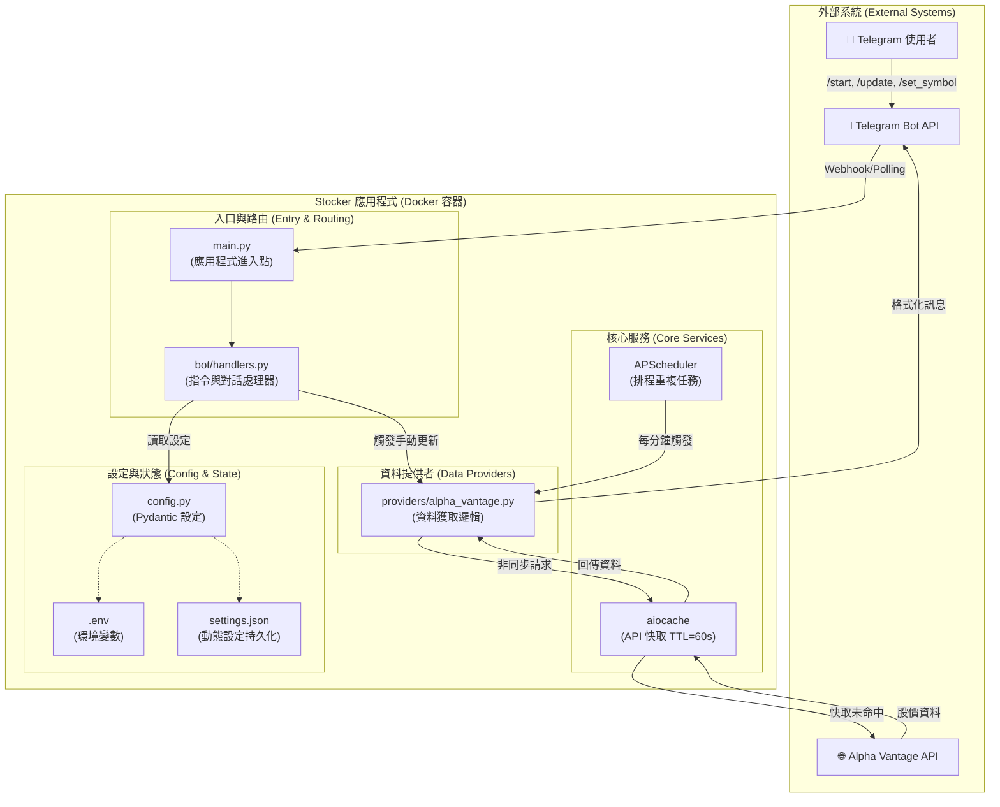

# Stocker 系統架構圖

這份文件使用 Mermaid.js 繪製了 Stocker 專案的系統架構組件圖，以視覺化方式呈現其內部結構與外部互動。

## 圖表解說

1.  **外部系統 (External Systems):**
    *   **Telegram 使用者:** 透過 Telegram 客戶端與機器人互動的最終使用者。
    *   **Telegram Bot API:** Telegram 官方提供的中介服務，用於接收使用者訊息並將機器人的回應傳遞給使用者。
    *   **Alpha Vantage API:** 提供股價資料的外部金融 API。

2.  **Stocker 應用程式 (Docker 容器):**
    *   **入口與路由:**
        *   `main.py`: 應用程式的主進入點，負責初始化 `Application`、設定日誌、註冊處理器和啟動排程器。
        *   `bot/handlers.py`: 包含所有指令 (`/start`, `/update`) 和對話 (`/set_symbol`, `/set_timer`) 的處理邏輯，負責解析使用者輸入並協調其他組件。
    *   **核心服務:**
        *   `APScheduler`: 用於執行重複性的背景任務，也就是定時獲取股價。
        *   `aiocache`: 實作了 API 快取層。所有對 `alpha_vantage.py` 的請求都會先經過這裡，如果在 TTL (60秒) 內有快取，則直接回傳，否則才向外部 API 發出請求。
    *   **資料提供者:**
        *   `providers/alpha_vantage.py`: 封裝了與 Alpha Vantage API 互動的所有邏輯，包括建立 HTTP 請求、解析回應和錯誤處理。
    *   **設定與狀態:**
        *   `config.py`: 使用 Pydantic 進行設定管理，從環境變數和 `settings.json` 載入設定。
        *   `.env`: 儲存 API 金鑰等機密資訊，此檔案不應被提交到版本控制中。
        *   `settings.json`: 用於持久化可在執行階段由使用者修改的動態設定，例如 `SYMBOL` 和 `TIMER_INTERVAL`。

3.  **互動流程 (Interactions):**
    *   使用者指令透過 Telegram API 傳遞給 `main.py`，再由 `bot/handlers.py` 處理。
    *   排程器 (`APScheduler`) 或手動指令都會觸發 `alpha_vantage.py` 中的資料獲取函式。
    *   資料獲取會先檢查 `aiocache` 快取。如果快取未命中，才會向 `Alpha Vantage API` 發出真實請求。
    *   獲取到的資料最終會被格式化並透過 Telegram API 回傳給使用者。
