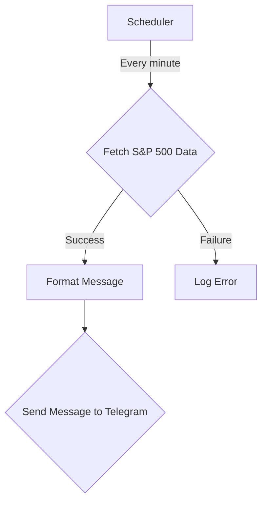

# Telegram S&P 500 Tracking Bot Plan

This document outlines the plan for creating a Telegram bot that tracks the S&P 500 and sends updates to a channel every minute.

## Workflow Diagram

## Technology Stack

*   **Language:** Python
*   **Telegram Bot Library:** `python-telegram-bot`
*   **HTTP Client:** `requests` (for fetching financial data)
*   **Scheduler:** `apscheduler`

## Phase 1: Setup and Configuration

*   [ ] Create a new Telegram bot using BotFather to get the API token.
*   [ ] Create a new public Telegram channel.
*   [ ] Add the bot to the channel as an administrator.
*   [ ] Create a Python virtual environment.
*   [ ] Install the required libraries: `python-telegram-bot`, `requests`, and `apscheduler`.
*   [ ] Create a `config.py` file to store the API token and channel ID.
*   [ ] Add `.gitignore` to exclude the virtual environment and `config.py` from version control.

## Phase 2: Core Logic

*   [ ] In a new file `main.py`, implement a function to fetch S&P 500 data from a financial data API (e.g., Alpha Vantage, Finnhub).
*   [ ] Implement a function to format the data into a user-friendly message.
*   [ ] Implement a function to send the formatted message to the Telegram channel using the `python-telegram-bot` library.
*   [ ] Use `apscheduler` to schedule the data fetching and message sending to run every minute.
*   [ ] Add error handling to gracefully handle API failures or other issues.
*   [ ] Implement logging to record the bot's activity.

## Phase 3: Deployment and Monitoring

*   [ ] Choose a deployment platform (e.g., Heroku, a VPS).
*   [ ] Create a `requirements.txt` file.
*   [ ] Write a `Procfile` for Heroku or a systemd service file for a VPS.
*   [ ] Deploy the bot.
*   [ ] Set up a monitoring service (e.g., UptimeRobot) to check the bot's health.

## Phase 4: Refinement

*   [ ] Add a command to the bot to manually trigger an update.
*   [ ] Add a command to the bot to show the current S&P 500 price.
*   [ ] Allow users to subscribe to updates for other stocks.
